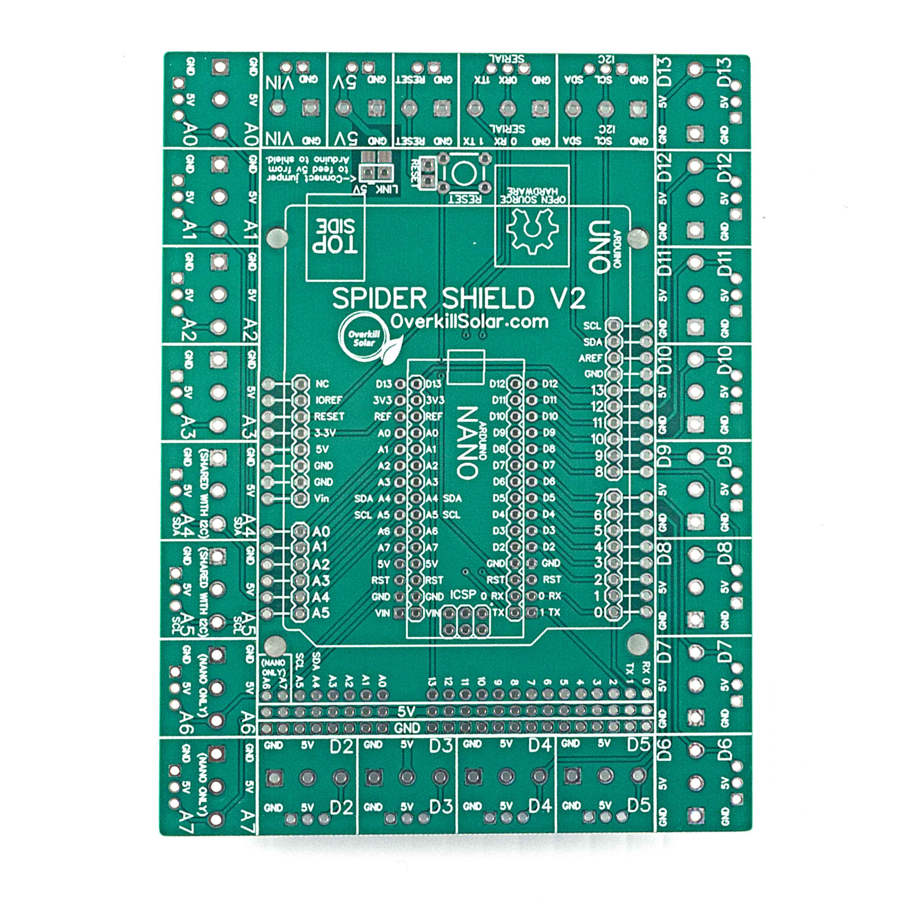
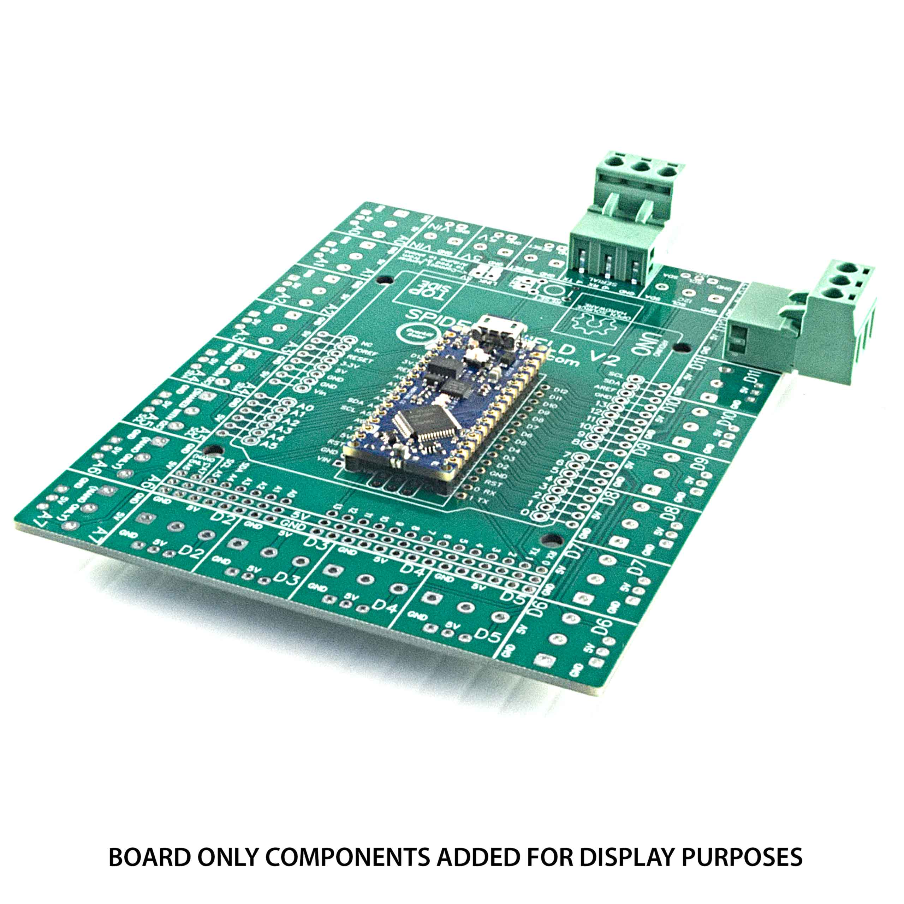

# Spider-Shield-pluggable-shield-V2
Breakout board for Arduino Nano and Uno

This is a breakout shield for the Arduino Nano and UNO.
It was designed in house by Overkill Solar for an internal project.    

## License
This project is open source hardware, see license.txt

We are offering the extra boards for sale at this address: https://overkillsolar.com/product/spider-shield-v2/

It accommodates both the Nano and Uno, including the Nano’s extra analog inputs.

Every I/O pin is broken out into a .200″ and .100″ footprint which works with any shape of pluggable (or normal) screw connectors, or pin headers.

The intention was to allow a bunch of limit switches and sensors to plug in while keeping a low profile. Straight connections can also be used instead of right angle connectors. The shield can be used as shown or mounted upside down with the Arduino on top. Other Uno shaped shields (like the relay shield) can also stack with it, there is no interference with the connectors.

There are a bunch of extra points to connect 5v and ground in the middle as well as another full set of I/O pins. There is a jumper that connects all the 5v pins to the Arduino, or you can remove the jumper and back feed the shield from another 5v supply.

Front side:    

Iso view:     

